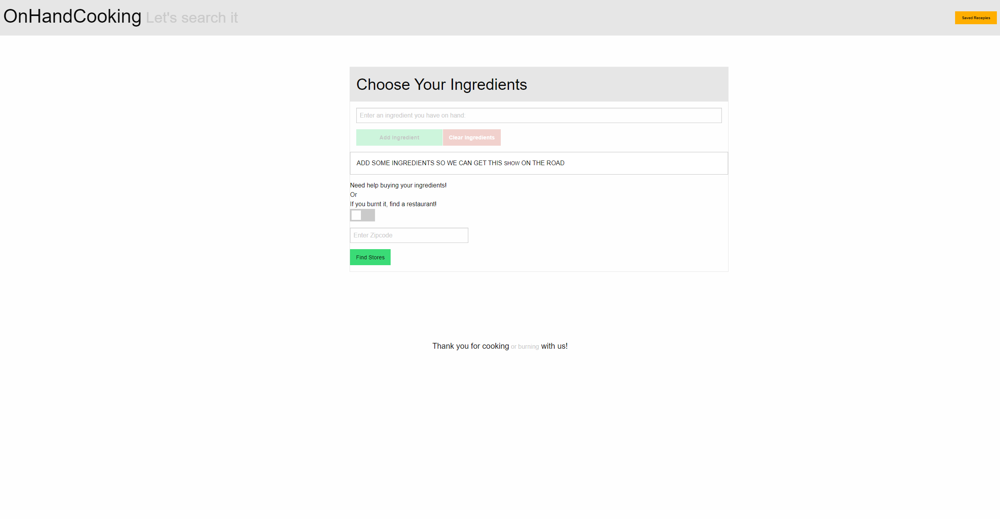
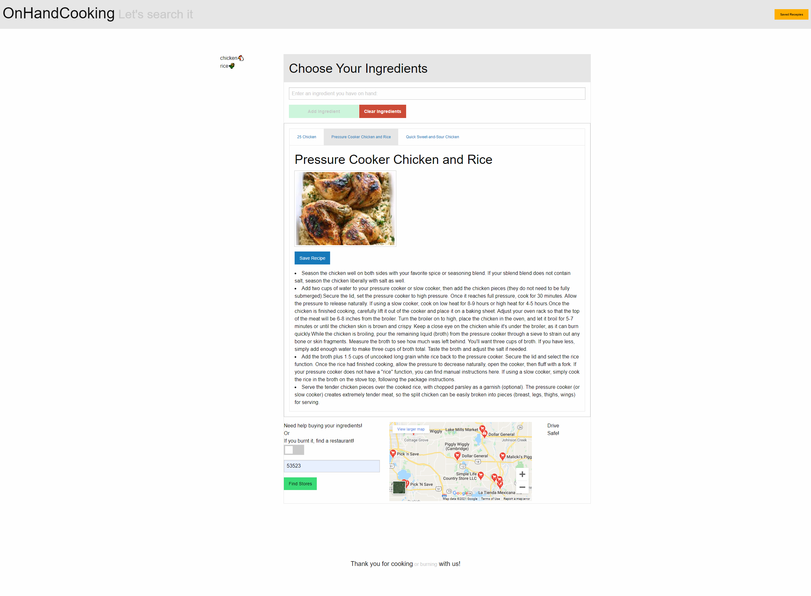
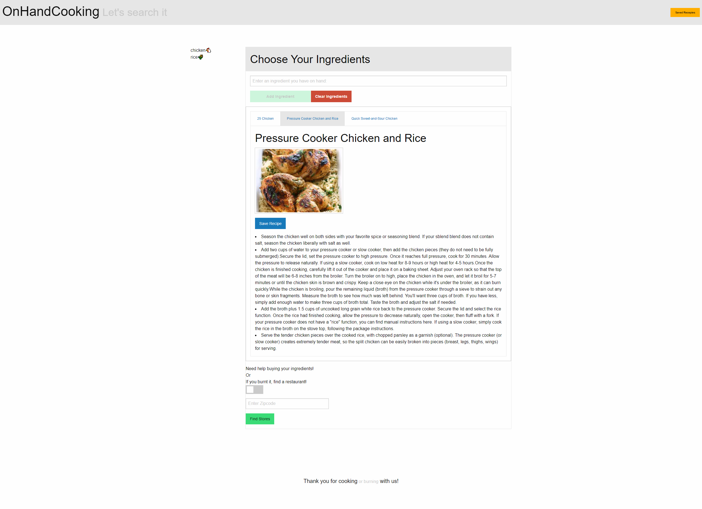
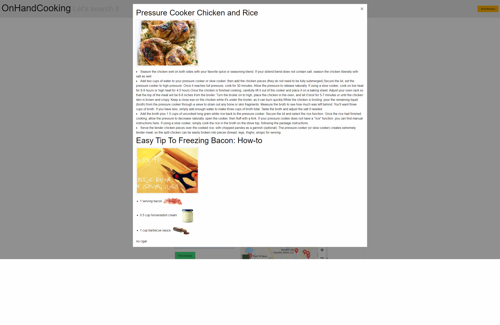

# On Hand Cooking
Imagine being at home on a Wednesday during a busy work week and you are getting hungry, it’s getting late and the curfew is about to hit. You are contemplating whether to go to the store or not. You open the fridge but nothing comes to mind on what to make right off the bat. I suppose you could make that chicken and rice dish you had on Monday but what if you had a way to  search for a new recipe based on the ingredients you have on hand?

## Description
This application's purpose is to function as a quick way to find recipes based on what ingredients you have readily available.  The user enters in the ingredients that they have.  As they enter ingredients they are given recipes that include the ingredients they have provided.  If they enter their zipcode they can generate a map with nearby grocery stores.  If they flip the restaurant switch and enter their zipcode they can find restaurants of their chosen cuisine type nearby.  There is also a save function allowing them to recall their favorite recipes or recipes that they want to give a try at a later date.

## Screenshots

## Links
[Link to deployed application](https://cookitanddontburnit.github.io/onHandCooking/)

[Link to GitHub repository](https://github.com/cookItAndDontBurnIt/onHandCooking)

## Thank You
